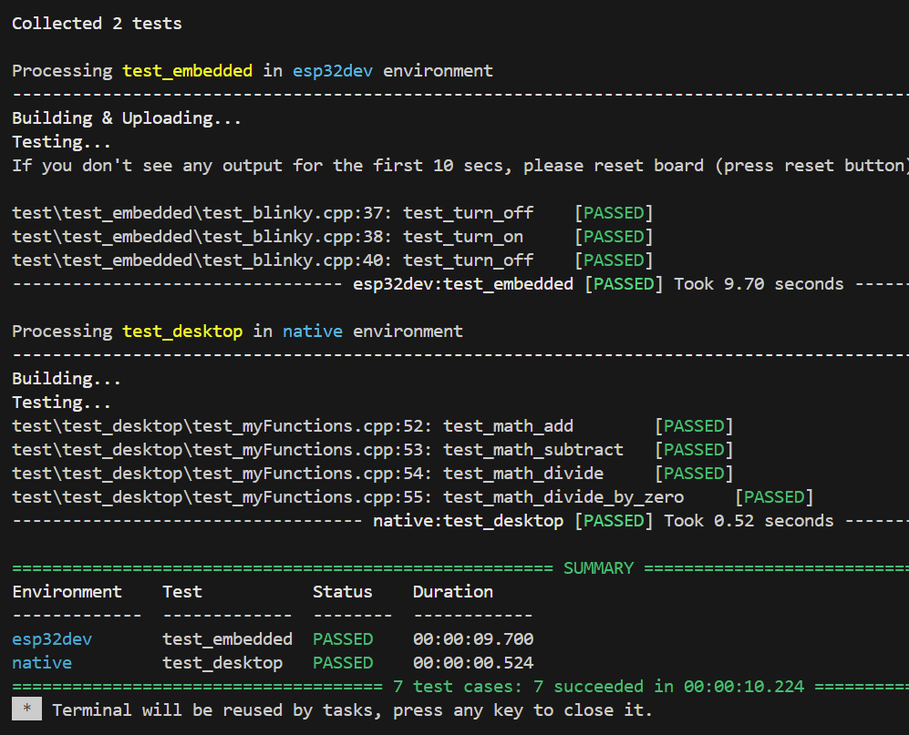

# Exploring Unit Testing on Arduino / ESP32

## Overview 
In this project I'm exploring [Unit Testing](https://docs.platformio.org/en/latest/advanced/unit-testing/index.html) for an embedded system.

I'm using the [Unity framework](https://docs.platformio.org/en/latest/advanced/unit-testing/frameworks/unity.html) for C in this version running in a VS Code environment with PlatformIO to talk to an ESP32 dev board. 

Tests are partitioned into those that run on the target hardware and those that run on the development (desktop) system. 

These tests are found in the `/test` directory tree under 
`/test/test_desktop` and `/test/test_embedded`, respectively.

The model is interesting. The test trees are sort of mini-projects with their own `main` function for `test_desktop` tests. For `test_embedded` tests, we have the usual Arduino `setup()` and `loop()` functions. 

By dividing the unit tests up like this, functionality that doesn't require the special features of the embedded processor can be tested much more quickly, lending itself to more of a TTD approach. 

Control over which tests get run is handled through the use of environment settings found in platformio.ini: 

### platformio.ini

```
[env:esp32dev]
platform = espressif32
board = esp32dev
framework = arduino
monitor_speed = 115200
upload_port = COM9
test_ignore = test_desktop

[env:native]
platform = native
test_ignore = test_embedded
```

In this example project, I've put together a little brain-dead math library (add, subtract and divide) and a library for turning on and off an LED. 

## Screenshot

Notice the difference below in testing speed between the two environments. Upload time to the ESP takes a while before the tests can start. 

Terminal output: 



## License

Free for others to use at their own risk. No warrantee offered or implied. 


I hope this might be helpful. 
Cheers! -- John

